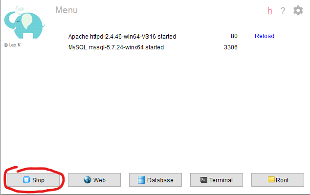
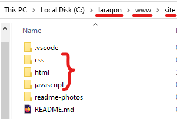
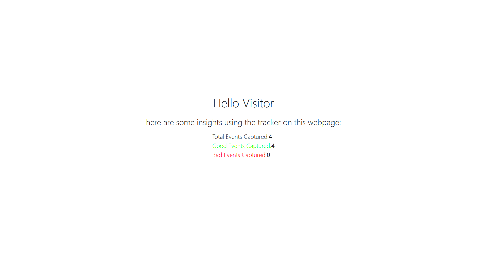

# Snowplow Demo App Setup

- First configure a working [Snowplow Micro instance within a Docker container](https://github.com/snowplow-incubator/snowplow-micro/).
- Then pull this codebase onto your local machine and host on any local development server (Apache, Nginx, etc.) - I recommend using [Laragon](https://laragon.org/) (as it's fast and easy to setup an Apache server).
  

- Now you move the relevant folders (`/html`, `/css`, `/javascript`) into some parent folder and onto your Apache server so you can view them via `http://localhost:<port>`. You may need to alter the [`index.html`](/html/index.html) URLs for connecting to Snowplow Micro - _see comments in file_.

  - For Laragon, this is the `/www` folder found under your Laragon installation:

    

- Ensure your Snowplow Micro Docker container is running and simply visit the local web server to view the web page.
  

Currently the demo serves to simply show insights taken from the Micro API endpoints - this could be extended to provide a dashboard for an analytics team to view their Tracker data clearly and draw further insights.

Currently despite an Ajax request being made using jQuery, page refresh is needed to view recent changes to tracker data (new page views).

The simple solution here is polling the relevant endpoint at regular intervals, but this introduces further difficulty with potential rate limiting. The best approach (at a surface level) would be to have some form of polling based on the expected page visit frequency, or even better to simply allow the user to view total events for a given time period; in which case we simply query our Micro API for all events (on page load) and display for selected period(s) - on refresh a User can view "Date created -> Current". It would mean no real time tracker data but overall is more fit for the purpose of the dashboard with much less overhead.
